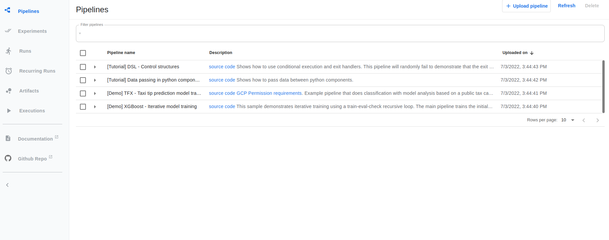

# Setup


# Revisar si existe minikube en contenedor
```bash
docker container ls -a 
```


# Correr server minikube
```bash
minikube start 
```


# Revisar por corriendo
```bash
kubectl get pods -A
```


# Instalar kubeflow pipeline en la forma standalone
```bash
 export PIPELINE_VERSION=master
 kubectl apply -k "github.com/kubeflow/pipelines/manifests/kustomize/cluster-scoped-resources?timeout=90s?ref=$PIPELINE_VERSION"
 kubectl wait --for condition=established --timeout=60s crd/applications.app.k8s.io
 kubectl apply -k "github.com/kubeflow/pipelines/manifests/kustomize/env/platform-agnostic-pns?timeout=90s?ref=$PIPELINE_VERSION"
```


Existe también con todos los pasos. Ejecutarlo como:
```bash
bash install-kubeflow-pipelines.sh
``` 

# Revisar deployments y servicios de kubeflow
```bash
kubectl get deployments -n kubeflow
```


```bash
kubectl get services -n kubeflow
```


# Ejecutar Kubeflow Pipeline
```bash
kubectl port-forward -n kubeflow svc/ml-pipeline-ui 8080:80
```
Entrar como localhost:8080



Un aspecto interesante también a notar es el uso de [minio](https://min.io/) como almacén de archivos. Esto se puede visualizar tanto en los deployments y servicios generados.


# Instalar OpenFaaS

```bash
curl -SLsf https://cli.openfaas.com | sudo sh
kubectl rollout status -n openfaas deploy/gateway
kubectl port-forward -n openfaas svc/gateway 8080:8080
```
Luego es solo loguearse. 

Importante: Ejecutar la siguiente instrucción para obtener la contraseña. El usuario es admin.
```bash
PASSWORD=$(kubectl get secret -n openfaas basic-auth -o jsonpath="{.data.basic-auth-password}" | base64 --decode; echo)
echo $PASSWORD
```


# Confirmar inslatación
Para confirmar con la instalación de OpenFaaS imprimos los namespaces creados.

```bash
kubectl get namespaces
```


# Revisar funciones creadas
```bash
kubectl get pods -n openfaas-fn
```


# Construir imagen del modelo con OpenFaaS
```bash
faas-cli build
```
## Revisar imagenes creadas en docker
```bash
docker images
```


# Desplegar modelo con OpenFaaS
```bash
faas-cli up
```

## Revisar función creada
```bash
kubectl get pods -n openfaas-fn
```


