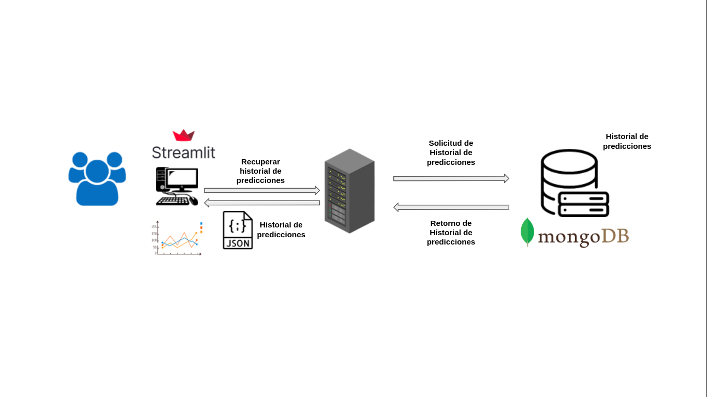

# Aplicativo de detección de vulnerabilidades

## Arquitectura 

### Predicción de código C++

### Historial de predicciones  

 
## Funcionalidad
1. Entrada de código y ver vulnerabilidades a la derecha. 
2. Historial de detecciones desplegadas desde MongoDB. 

## Referencias:

# ¿Porque escogió esa aplicación? ¿Qué características de la computación en nube pueden ser integradas en la aplicación? (Jorge)
Escogimos esta aplicación, ya que actualmente lo estamos desarrollando en el curso de Cyberseguridad y deseamos aplicar los conocimientos de Cloud Computing a nuestro proyecto. Las caracteristicas que pueden ser integradas son: escalabilidad, contenerizacion y orquestamiento de contenedores.

# Resumen de los pasos necesarios para su ejecución. (Jorge)
